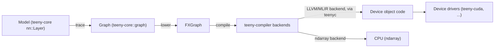

# Compilation Flow

At a high level, a model goes from traced graph to running device code like this:

- **Trace**: your model, built from `teeny-core::nn` layers, is called with a symbolic input,
  recording a `teeny-core::graph::Graph` — see
  [Tensors & the Computational Graph](./tensors-and-graph.md).
- **Lower**: the graph is lowered to FXGraph, `teeny-compiler`'s intermediate representation.
- **Compile**: `teeny-compiler` ([API docs](https://docs.teenygrad.org/api/teenygrad/teeny_compiler/))
  compiles FXGraph to a target backend:
  - The **LLVM/MLIR backend** shells out to the custom `teenyc` compiler at runtime
    (`-Zcodegen-backend=mlir`) — see [The LLVM/MLIR Backend](../compiler-internals/llvm-backend.md).
  - The **`ndarray` backend** (feature-gated, default-on) runs on CPU without `teenyc`.
- **Device drivers**: compiled device code is loaded and run through a driver crate — today,
  [`teeny-cuda`](https://docs.teenygrad.org/api/teenygrad/teeny_cuda/) for NVIDIA GPUs. `teeny-cpu` and
  `teeny-vulkan` are planned but not yet implemented (only `drivers/teeny-cuda` exists in the
  workspace today).

Kernels themselves (the actual per-op device code, e.g. attention, matmul, elementwise ops) are
defined separately — see [Kernels & Backends](../kernels-and-backends/backends.md).

## Ahead-of-time vs. just-in-time

The same compilation pipeline can run either eagerly (JIT, at model-run time) or ahead of time
(AOT, producing cached artifacts you deploy without a compiler on the target device) — see
[`teeny-cli` and Ahead-of-Time Compilation](../cli-and-aot/teeny-cli.md).
