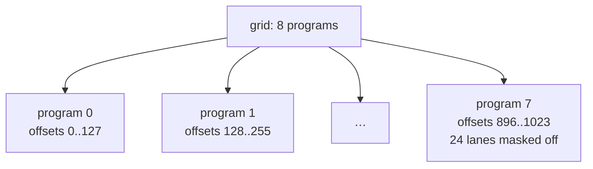

# You Program a Block, Not a Thread

There are two ways to write the "one worker's job" from the last chapter. This
chapter is about which one teenygrad uses, and why the difference matters more
than it first appears.

## The two models

In CUDA, the unit you write for is **one thread handling one element**. Your
code says "I am thread number 4,721, so I will add element 4,721". The hardware
starts millions of these. If you want a thread to cooperate with its neighbours
— to sum a row, say — you arrange that yourself, with shared memory and explicit
barriers.

This is called SIMT: Single Instruction, Multiple Threads.

In Triton, and so in teenygrad, the unit you write for is **one program handling
a block of elements**. Your code says "I am program number 36, so I will handle
elements 4,608 through 4,735". You do not write anything per-element. You write
operations on the whole block at once, and the compiler works out how to spread
that across the actual hardware threads.

If you have used NumPy, you already have the right instinct. `a + b` on two
arrays does not make you write a loop. Neither does a Triton kernel.

## Seeing it

Here is the beginning of the vector-add kernel from Chapter 5:

```rust
{{#include ../../../../kernels/teeny-triton/examples/vector_add.rs:indices}}
```

Two of those three values are plain integers. The third is not.

`pid` is a single integer — which program am I. `block_start` is a single
integer — where my slice begins. But `offsets` is a **tensor**: `arange(0, 128)`
produces all 128 indices at once, and adding `block_start` shifts every one of
them. From there on, every operation in the kernel works on 128 values in
parallel without a loop in sight.

The picture, for a vector of 1000 elements in blocks of 128:



Each box runs the same code. Each computes a different `pid`, and therefore a
different `offsets`. Nothing coordinates them, and they may run in any order or
all at once.

## Why this is the better default

**Cooperation comes free.** Summing a row in CUDA means a shared-memory
reduction: allocate scratch, have each thread write its partial, synchronise,
have half the threads combine pairs, synchronise again, repeat. In Triton it is
`T::sum(x, None, false)`. The compiler emits the same shuffles and barriers; you
do not write them, and you cannot get them subtly wrong.

**The compiler can see what you meant.** Because you said "load these 128
contiguous addresses" rather than "load this one address" a hundred and
twenty-eight times, the compiler knows the access pattern and can combine it
into the smallest number of memory transactions. Recovering that from
per-thread code is much harder.

**It is far less code.** Most of the ceremony in a CUDA kernel is bookkeeping —
index arithmetic, bounds checks, barriers — that the block model removes.

The cost is control. There are hand-tuned CUDA kernels that beat what this model
will produce, and if you need one of those, you need CUDA. For nearly everything
else the trade is worth it.

## The words, and where they leak

Four terms, used consistently from here on:

| Term | What it is |
|---|---|
| **program** | One instance of your kernel. What your code describes. |
| **block** | The slice of data one program handles. `BLOCK_SIZE` elements. |
| **grid** | How many programs to launch. Computed on the CPU, before launch. |
| **lane** | One element's position within a block. |

You will also meet CUDA's vocabulary, because teenygrad sits on top of CUDA and
does not hide it completely. Three terms in particular:

- A **thread** is the hardware's unit. A program is implemented as a group of
  threads. When you set a block size of 128, you are also saying "128 threads".
- A **warp** is 32 threads that execute in lockstep, always. This is why block
  sizes are multiples of 32 — a block of 100 wastes most of a fourth warp.
- A **CTA** (cooperative thread array) is CUDA's name for what Triton calls a
  program. It shows up in this SDK's API: `RuntimeOp::grid` is documented as the
  "number of CTAs to launch".

You do not need to think in threads to write kernels. You do need to recognise
the words when the API or an error message uses them.

## One thing to carry forward

When you read a kernel in this book, read it as **one** program. Ask "what is
this one doing, and how does it know which part is its?" — never "how do all of
them work together?", because they do not. They are independent by construction.

Next: what actually happens to your Rust when you write it.
