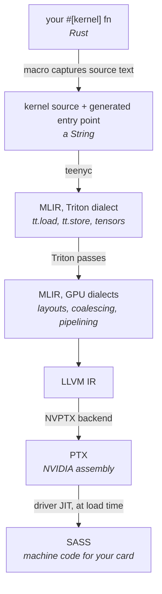

# From Rust to PTX

Your kernel is a Rust function. Your GPU does not run Rust. This chapter is
about what happens in between.

It is worth reading before you write a kernel rather than after, because the
answer is genuinely unusual, and almost every rule in Parts 2 and 3 is a
consequence of it.

## The surprise

Here is the thing to know:

> Your kernel function is never called by your program. It is captured as
> **text**, and compiled by a different compiler.

When you write `#[kernel]` on a function, the macro keeps the function — it
compiles normally, as ordinary Rust, and the Rust compiler type-checks it. But
the macro also converts the function's source code back into a string and stores
that string in a generated struct.

That string is the real artefact. It gets handed to `teenyc`, a separate
compiler binary, which compiles it for the GPU.

So the function is type-checked twice, by two different compilers, and executed
by neither of them in the way you would expect.

## Why do it that way

Because the two compilers need different things from the same code.

The Rust compiler you already have is very good at checking that your kernel
makes sense: that you did not pass a float where an index belongs, that the
tensor ranks line up, that the dtype you loaded is the dtype you stored. Doing
that check is exactly what `T: Triton` and those `where` clauses are for. None
of it needs a GPU.

But that compiler cannot emit GPU code. Producing something a graphics card will
run means going through MLIR and the Triton compiler passes, and that is what
`teenyc` — a modified rustc — exists to do.

Capturing the source is the seam between the two. You get Rust's type checking
on kernels, from an ordinary `cargo check`, without the GPU toolchain being
involved at all.

## The pipeline

The stages that matter to you:

**The captured string.** Source text, plus a small wrapper the macro generates.
Chapter 8 shows it in full.

**MLIR in the Triton dialect.** Your kernel, still recognisable, expressed as
operations on tensors. This is the most useful thing to look at when a kernel
misbehaves, and Chapter 9 reads one.

**The Triton passes.** Where the compiler decides how your block maps onto real
threads, how loads are combined, and where data lives. This is the part you do
not control directly, and mostly should not want to.

**PTX.** NVIDIA's portable assembly. This is what `compile_kernel` gives you back
— a `.ptx` file on disk.

**SASS.** The actual machine code, produced by the driver when the PTX is
loaded, targeted at the exact chip present. You never see this, and it is why a
single PTX file works across several card generations.

## What this costs you

Four consequences, all of which you will meet.

**The kernel body is compiled in a different world.** `teenyc` compiles your
captured text against a small generated environment — not against your crate,
and not against the real standard library. So a `println!` in a kernel body will
type-check happily in your editor and then fail in an unfamiliar compiler. You
cannot call your own helper functions from a kernel body either, unless they
are part of that environment.

**Everything must be knowable from the text.** This is why `BLOCK_SIZE` is a
const generic rather than an argument, and why `T::reduce` takes a plain `fn`
pointer instead of a closure — a closure that captured a variable could not be
written out as source. Chapter 13 comes back to this.

**Compilation happens at run time, not build time.** `cargo build` does not
produce PTX. The first time your program calls `compile_kernel`, it shells out
to `teenyc`. Results are cached on disk, keyed by the kernel's identity, so it
happens once rather than every launch.

**You need `teenyc` installed to run anything, but not to build anything.** This
is genuinely useful: `cargo check` on a crate full of kernels works on a laptop
with no GPU and no toolchain. Only running needs the rest.

## Where the pieces live

| Piece | Crate | What it does |
|---|---|---|
| `#[kernel]` | `teeny-macros` | Captures the source, generates the struct and entry point |
| `Triton` trait | `teeny-triton` | The operations a kernel body may use |
| `compile_kernel` | `teeny-cuda` | Finds `teenyc`, runs it, caches the PTX |
| `teenyc` | separate toolchain | The modified rustc that emits GPU code |
| `Device`, `launch` | `teeny-cuda` | Loads the PTX and runs it |

Two environment variables are worth knowing now, because they are how you fix
things when the toolchain is not where it should be:

- `TEENYC_PATH` — the `teenyc` binary to use. Without it, the compiler looks for
  a single rustup toolchain whose name contains `teenyc`, and fails clearly if
  there are none or several.
- `TEENYC_CACHE_DIR` — where compiled PTX is cached. Defaults to
  `/tmp/teenyc_cache`.

Next: getting all of that installed.
